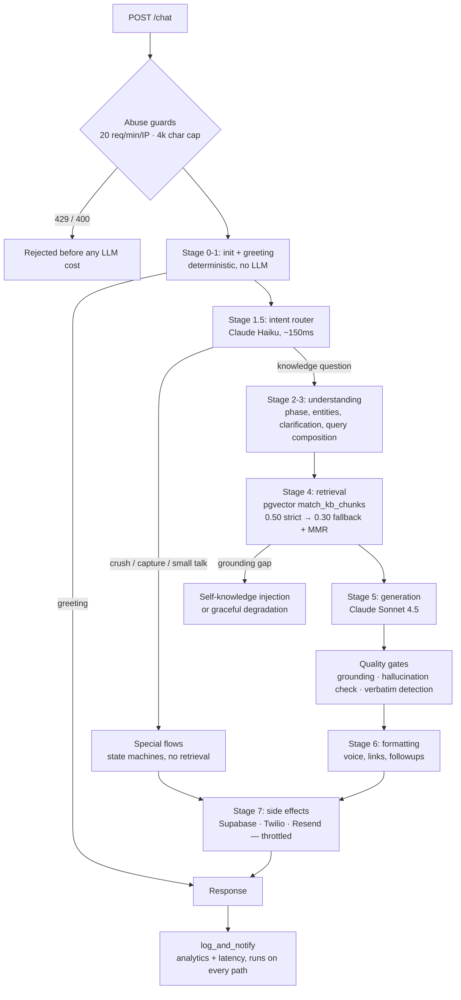
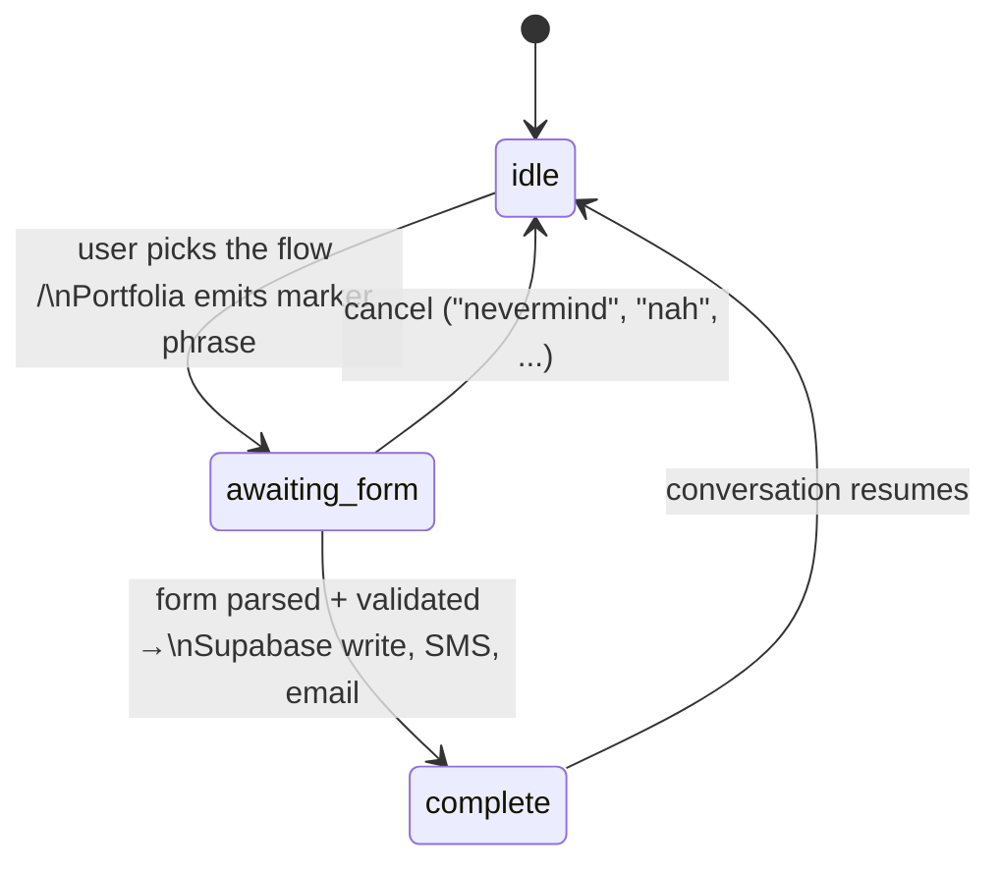

# Architecture

How Portfolia works and, more importantly, why it is built the way it is.
This is the deep-dive companion to the [main README](../README.md); every
claim here is checkable against the code, and the paths cited are real.

Live system: [noahdelacalzada.com](https://noahdelacalzada.com/) →
Next.js on Vercel ([portfolia-frontend](https://github.com/iNoahCodeGuy/portfolia-frontend))
→ FastAPI on Railway (this repo) → Supabase pgvector + Anthropic + OpenAI
embeddings, with Twilio/Resend side effects.

## The one-paragraph version

Every message POSTs to a single endpoint (`api/main.py`), which runs a
22-node functional pipeline (`assistant/flows/conversation_flow.py`). The
pipeline classifies intent *before* retrieving, short-circuits anything that
doesn't need the knowledge base, retrieves with two similarity thresholds,
generates with Claude Sonnet 4.5, then pushes the draft through quality
gates before a visitor sees it. Multi-step flows are state machines
recovered from the transcript on every turn — no server-side session state
is required — and all real-world side effects (database writes, SMS, email)
are triggered by pipeline code, never by the model.

## Request lifecycle



## The 22-node pipeline

The orchestrator is a plain function loop — `state = node(state)` with
partial-dict merging — not a graph engine. Node list, verbatim from
`assistant/flows/conversation_flow.py`:

| Stage | Nodes | Job | Short-circuits? |
| --- | --- | --- | --- |
| 0 — init | `initialize_conversation_state` | defaults + clear volatile per-turn fields | |
| 1 — first contact | `prompt_for_role_selection`, `handle_greeting` | first-turn menu, deterministic hello handling | greeting exits here |
| 1.5 — intent routing | `classify_message_intent`, `handle_non_knowledge_intent` | Claude Haiku classification; answers non-knowledge intents | crush/capture/small-talk exit here |
| 2 — understanding | `classify_role_mode`, `classify_intent`, `detect_conversation_phase`, `extract_entities` | welcome routing, query type, conversation phase, entity hints | |
| 3 — query prep | `assess_clarification_need`, `ask_clarifying_question`, `presentation_controller`, `compose_query` | vague-query gate, depth control, retrieval-ready prompt | too-vague queries exit with a question |
| 4 — retrieval | `retrieve_chunks`, `validate_grounding`, `handle_grounding_gap` | pgvector search + MMR, similarity gate, self-knowledge fallback | insufficient grounding degrades gracefully |
| 5 — generation | `generate_draft`, `hallucination_check` | Claude Sonnet 4.5 + deterministic claim verification | |
| 6 — enrichment | `plan_actions`, `format_answer` | queue side effects, voice enforcement, followups, link throttling | |
| 7 — finalization | `execute_actions`, `update_memory` | fire queued side effects, bounded session memory | |
| post-loop | `log_and_notify` | Supabase analytics + latency — runs even on short-circuit | |

Node implementations live in `assistant/flows/node_logic/` (one module per
stage, split helpers in `util_voice.py`, `util_links.py`,
`util_followups.py`, `util_discovery_hooks.py`); the capture state machines
live in `assistant/flows/capture/`.

## Design decisions

### 1. Classify intent before retrieving

The fundamental problem with naive RAG chatbots: they treat every message
the same. Someone says "hello" and the system embeds it, searches a vector
database, retrieves nothing useful, and generates a strange three-paragraph
answer to a greeting. That is slow, costs money, and produces the worst
responses in the system exactly where users form first impressions.

So the first real decision in the pipeline is a ~150ms Claude Haiku
classification (`classify_message_intent`, stage 1.5), and everything
non-knowledge — greetings, small talk, crush confessions, contact capture,
gibberish — short-circuits before any embedding happens. Retrieval runs
only for messages that actually need the knowledge base.

### 2. Multi-step flows are stateless state machines

The constraint: the backend must work without server-side session storage
(serverless-compatible, no Redis, survives restarts). But contact capture
and the crush-confession flow span multiple turns.

The approach: each flow is a finite state machine whose current step is
*recovered from the conversation transcript* on every turn. Marker phrases
in Portfolia's own prior responses act as checkpoints — the detector
lowercases and matches them (`assistant/flows/capture/constants.py` keeps
producer and detector on the same constants, so they cannot drift apart).
A form submission parses fields, validates, writes to Supabase, fires
notifications, and returns to normal conversation.



The state machine — not the model — guarantees steps cannot be skipped or
reordered. That is the failure mode that kills LLM-driven agents in
production: the model "decides" to confirm before the write succeeded, or
hallucinates a tool call. Here the LLM never chooses whether a side effect
fires; pipeline code does.

### 3. Deterministic side effects, throttled at the choke point

`plan_actions` queues actions; `execute_actions` fires them
(Supabase writes, Twilio SMS, Resend email in
`assistant/flows/capture/notifications.py`). Two protections:

- The `/chat` endpoint rate-limits per IP (20/min) and caps message length
  (4,000 chars) **before** any embedding or LLM call (`api/main.py`).
- Notification dispatch has its own sliding-window cap (10/hour, global)
  because the protected resource is a human's phone, not per-client
  fairness. Throttled submissions still land in the database — only the
  ping is skipped.

### 4. Quality gates between the model and the user

Three checks run on generated answers (stage 5,
`assistant/flows/node_logic/stage5_generation_nodes.py`):

- **Grounding validation** — retrieval similarity must clear a threshold
  before generation proceeds; below it, the pipeline degrades gracefully
  instead of letting the model improvise. Self-knowledge questions ("how
  were you built?") inject a synthetic source chunk rather than pretending
  the KB covered them.
- **Hallucination check** — deterministic, not LLM-as-judge: every
  percentage, dollar amount, and URL in the draft must appear in the
  retrieved chunks or in the prompt's stated fact list. Rollout is staged
  via `HALLUCINATION_GATE`: `log` (default) records findings to analytics,
  `enforce` swaps in a safe fallback, `off` disables. Ship in log mode,
  measure the false-positive rate, then enforce.
- **Verbatim-copy detection** — generated answers that copy retrieved
  chunks nearly word-for-word get flagged; the KB is source material, not
  a script.

### 5. Two retrieval thresholds instead of one

A single similarity cutoff forces a bad trade: strict means "I don't know"
too often; loose means weakly-related chunks reach the prompt. Retrieval
(`assistant/retrieval/pgvector_retriever.py`, RPC `match_kb_chunks`) tries
0.50 first, falls back to 0.30 for broader recall, and records which mode
produced the answer — so precision is the default and recall is a visible,
logged exception rather than a silent one.

### 6. A function loop instead of a graph engine

The pipeline is LangGraph-*style* — nodes returning partial state updates —
but the runtime is ~30 lines of loop. An earlier iteration carried the
langgraph dependency; it was removed once it was clear the graph engine
added an import-time dependency and cold-start cost while the control flow
remained strictly linear with short-circuits. Structure survives; the
framework did not need to.

### 7. Bounded memory, stateless server

Session memory prunes itself: sliding windows cap tracked topics (10),
entities (20), and history backups (6), so long conversations cannot grow
state without bound. The frontend can send full `chat_history` per request
(stateless mode); the in-memory session store in `api/main.py` is a
convenience fallback for the single-instance deployment, not a requirement.

## Knowledge-base engineering

The KB is ~200 curated chunks across CSVs in `data/` — each row authored
for retrieval (one concept per chunk, question-shaped sections), not
scraped. Editing a CSV changes nothing until re-embedded:

```bash
python3 scripts/migrate_data_to_supabase.py --all --force   # full rebuild
python3 scripts/verify_kb_parity.py                         # prove live == git
```

Every chunk carries provenance metadata (`source` CSV, `content_sha256`,
`migrated_at`), and `scripts/verify_kb_parity.py` compares live row counts
and content hashes against the CSVs — including flagging *orphaned* chunks
(rows from older embedding runs that no current CSV produces, which would
otherwise keep getting retrieved forever). Retrieval serves what is in the
database, not what is in git; this makes the difference checkable.

## Observability and failure behavior

- **LangSmith** traces every LLM call — prompt, response, latency, cost
  (see [OBSERVABILITY.md](OBSERVABILITY.md) / [LANGSMITH.md](LANGSMITH.md)).
- **Sentry** (gated on `SENTRY_DSN`) receives unhandled route errors *and*
  the pipeline errors that `/chat` masks behind its graceful-fallback
  response — good UX should not mean invisible outages.
- **Analytics** land in Supabase per conversation: latency, retrieval
  stats, capture events, hallucination-check findings.
- **Degradation:** optional services (Twilio, Resend, LangSmith, Sentry)
  are skipped with a log line when unconfigured; required-service failures
  produce a graceful fallback answer, never a stack trace to the visitor.

## Honest limitations

Single-instance assumptions are documented where they live: the rate
limiter and notification throttle are in-memory (correct for one Railway
instance; the upgrade path is Upstash/Redis), and the server-side session
store is a fallback rather than a source of truth. Test coverage is real
but not exhaustive — the hermetic suite (~100 tests, no API keys) gates CI,
and live-API evals are opt-in (`pytest -m live`). These are the trade-offs
of a production system run by one person, chosen deliberately and cheap to
revisit.
